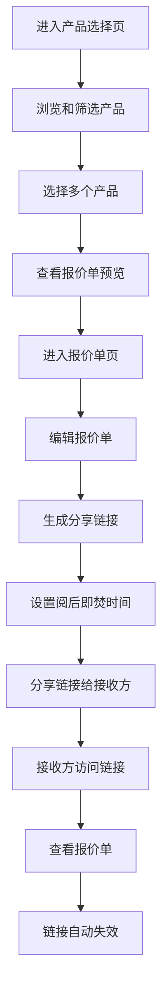

## 1. 产品概述
一个基于Vue3的产品报价单生成和分享系统，允许用户从JSON数据中选择产品并创建可分享的报价链接。
- 主要目的是简化产品报价流程，方便用户快速生成和分享报价单
- 目标用户为需要频繁生成产品报价的销售人员、采购人员和企业用户

## 2. 核心功能

### 2.1 用户角色
| 角色 | 注册方式 | 核心权限 |
|------|---------------------|------------------|
| 普通用户 | 无需注册 | 浏览产品、创建报价单、分享链接 |
| 管理员 | 后台登录 | 管理产品数据、设置阅后即焚时间、查看分享统计 |

### 2.2 功能模块
1. **产品选择页**：产品列表展示、产品筛选、产品多选
2. **报价单页**：已选产品展示、报价单编辑、分享功能
3. **分享链接页**：只读报价单展示、防截图保护、阅后即焚功能

### 2.3 页面详情
| 页面名称 | 模块名称 | 功能描述 |
|-----------|-------------|---------------------|
| 产品选择页 | 产品列表 | 从JSON数据源加载产品，支持按类别、价格等筛选，支持多选 |
| 产品选择页 | 报价单预览 | 实时显示已选产品和总价 |
| 报价单页 | 产品清单 | 展示已选产品详情，支持调整数量和删除 |
| 报价单页 | 分享功能 | 生成唯一分享链接，设置阅后即焚时间 |
| 分享链接页 | 报价单展示 | 只读模式展示报价单内容，禁止编辑 |
| 分享链接页 | 防截图保护 | 限制移动端截图，添加水印 |
| 分享链接页 | 阅后即焚 | 链接访问后自动失效，或在设定时间后失效 |

## 3. 核心流程
用户从产品列表中选择多个产品，添加到报价单，生成分享链接，接收方通过链接查看报价单，链接自动失效。

## 4. 用户界面设计
### 4.1 设计风格
- 主色调：深蓝色 (#1E40AF) 和白色 (#FFFFFF)
- 辅助色：浅蓝色 (#93C5FD) 和灰色 (#6B7280)
- 按钮风格：圆角设计，悬停效果
- 字体：Inter，标题18-24px，正文14-16px
- 布局风格：卡片式布局，响应式设计
- 图标风格：线性图标，简洁现代

### 4.2 页面设计概览
| 页面名称 | 模块名称 | UI元素 |
|-----------|-------------|-------------|
| 产品选择页 | 产品列表 | 卡片式产品展示，包含产品图片、名称、价格，多选框，筛选器 |
| 产品选择页 | 报价单预览 | 侧边栏或顶部固定区域，显示已选产品数量和总价 |
| 报价单页 | 产品清单 | 表格形式展示产品详情，包含数量调整和删除按钮 |
| 报价单页 | 分享功能 | 生成链接按钮，链接复制功能，阅后即焚设置 |
| 分享链接页 | 报价单展示 | 干净的只读界面，产品详情卡片，总价展示 |
| 分享链接页 | 防截图保护 | 全屏水印，移动端防截图提示 |
| 分享链接页 | 阅后即焚 | 倒计时显示，访问后提示链接已失效 |

### 4.3 响应式设计
- 桌面优先设计，适配平板和移动设备
- 移动端：单列布局，底部导航
- 平板：双列布局，侧边栏可折叠
- 桌面：三列布局，完整功能展示

### 4.4 交互设计
- 产品选择：多选框+批量操作
- 报价单编辑：实时计算总价
- 分享功能：一键生成链接并复制
- 防截图：全屏水印覆盖
- 阅后即焚：倒计时动画效果