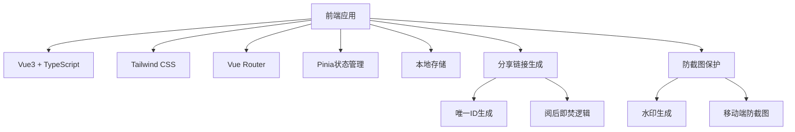
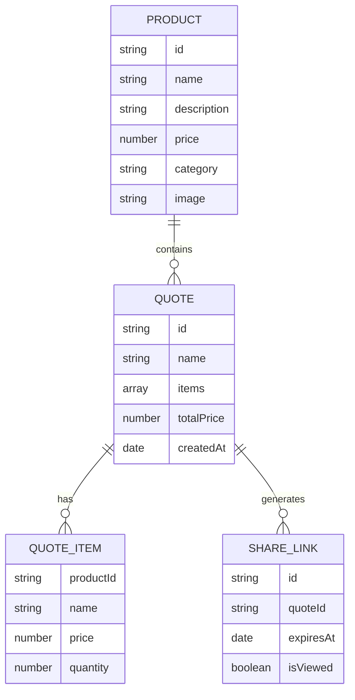

## 1. 架构设计


## 2. 技术描述
- 前端：Vue3@3.4 + TypeScript + Tailwind CSS@3 + Vite
- 路由：Vue Router@4
- 状态管理：Pinia@2
- 构建工具：Vite
- 数据存储：LocalStorage (前端临时存储)
- 分享链接：URL参数 + LocalStorage
- 防截图：CSS水印 + 移动端防截图API

## 3. 路由定义
| 路由 | 用途 |
|-------|---------|
| / | 产品选择页 |
| /quote | 报价单页 |
| /share/:id | 分享链接页 |

## 4. 数据模型
### 4.1 数据模型定义


### 4.2 数据定义语言
```javascript
// 产品数据结构
interface Product {
  id: string;
  name: string;
  description: string;
  price: number;
  category: string;
  image: string;
}

// 报价单项数据结构
interface QuoteItem {
  productId: string;
  name: string;
  price: number;
  quantity: number;
}

// 报价单数据结构
interface Quote {
  id: string;
  name: string;
  items: QuoteItem[];
  totalPrice: number;
  createdAt: Date;
}

// 分享链接数据结构
interface ShareLink {
  id: string;
  quoteId: string;
  expiresAt: Date;
  isViewed: boolean;
}
```

## 5. 核心功能实现方案
### 5.1 产品选择功能
- 从JSON文件加载产品数据
- 实现产品筛选和搜索
- 支持多选产品并添加到报价单
- 实时更新报价单预览

### 5.2 报价单管理
- 使用Pinia存储报价单数据
- 支持调整产品数量和删除产品
- 实时计算总价
- 本地存储报价单数据

### 5.3 分享功能
- 生成唯一分享链接ID
- 将报价单数据存储到LocalStorage
- 设置阅后即焚时间
- 复制链接到剪贴板

### 5.4 防截图保护
- 实现全屏水印覆盖
- 检测移动端设备并应用防截图措施
- 禁用右键菜单和选择功能

### 5.5 阅后即焚功能
- 记录链接访问状态
- 实现倒计时功能
- 链接访问后或过期后自动失效
- 清理LocalStorage数据

## 6. 项目结构
```
/src
  /assets            # 静态资源
  /components        # 组件
    /ProductCard     # 产品卡片组件
    /QuotePreview    # 报价单预览组件
    /ShareForm       # 分享表单组件
    /Watermark       # 水印组件
  /composables       # 可复用逻辑
    useProducts.ts   # 产品相关逻辑
    useQuote.ts      # 报价单相关逻辑
    useShare.ts      # 分享相关逻辑
  /pages             # 页面
    ProductSelection.vue  # 产品选择页
    QuotePage.vue         # 报价单页
    SharePage.vue         # 分享链接页
  /router            # 路由配置
  /store             # Pinia状态管理
  /types             # TypeScript类型定义
  /utils             # 工具函数
  App.vue            # 根组件
  main.ts            # 入口文件
/public
  /products.json     # 产品数据JSON文件
```

## 7. 技术实现细节
### 7.1 防截图保护实现
- 使用CSS `pointer-events: none` 和 `user-select: none` 禁止选择
- 实现全屏水印覆盖，使用 `position: fixed` 和 `z-index: 9999`
- 检测移动端设备，使用 `navigator.userAgent`
- 对于iOS设备，使用 `touch-action: none` 防止截图

### 7.2 阅后即焚实现
- 使用LocalStorage存储分享链接状态
- 生成唯一ID作为链接参数
- 实现访问计数器，限制访问次数
- 设置过期时间，自动清理过期数据

### 7.3 分享链接实现
- 使用URL参数传递分享ID
- 从LocalStorage加载对应报价单数据
- 实现链接验证和权限检查
- 支持链接失效后的友好提示

## 8. 性能优化
- 懒加载产品图片
- 使用虚拟滚动处理大量产品数据
- 防抖处理搜索和筛选操作
- 缓存已加载的产品数据

## 9. 安全性考虑
- 防止XSS攻击，对用户输入进行验证
- 保护分享链接的唯一性和安全性
- 限制LocalStorage存储大小
- 实现数据清理机制，避免存储泄漏